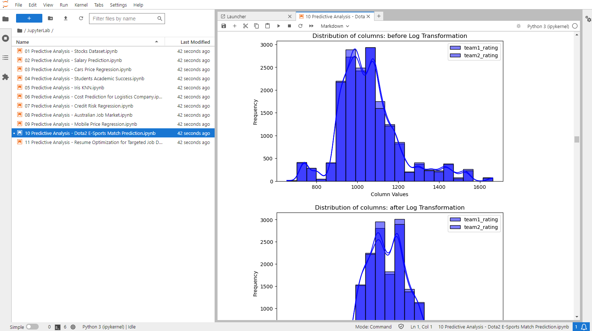

<a name="readme-top"></a>

<!-- PROJECT LOGO -->
<br />
<div align="center">
  <a href="https://github.com/ErnieSumoso/Data-Analysis">
    
  </a>

<h3 align="center">Data Analysis Repository</h3>
  I use this repository to store many of my data analyses, performed mostly on large datasets using Python.
  The repository is organized into folders by type of analytics: descriptive, diagnostic, exploratory, and predictive.
  If new types of analytics are performed, I will add new folders containing these analyses.
  <p align="center">
    <br />
    <a href="https://github.com/ErnieSumoso/Data-Analysis/pulls">Pull Requests</a>
    ·
    <a href="https://github.com/ErnieSumoso/Data-Analysis/issues">Issues</a>
  </p>
</div>


## About The Project

<div align="center">
  
</div>
This repository was originally created to store and track my learning process in data analysis, from descriptive to prescriptive.
Over the months, I have added most of my data analyses, ranging from basic to complex, on large datasets up to 21k rows.
The majority of these analyses were developed using JupyterLab for enhanced visualizations and development.
Feel free to explore and make suggestions on any of my solutions!
<p align="right">(<a href="#readme-top">back to top</a>)</p>


### Built With

* [![Python][python-badge]][python-url]
* [![JupyterLab][jupyter-badge]][jupyter-url]
* <a href="https://www.r-project.org/">
    
  </a>

<p align="right">(<a href="#readme-top">back to top</a>)</p>


## Getting Started

As this repository contains mostly Jupyter Notebook files, you only need basic Python and Jupyter software installations.
However, there are a couple of scripts that were developed using R-Studio.

### Prerequisites

To run the code you need at least the following components (R-Studio is optional).
* [Python 3+](https://www.python.org/downloads/)
* [JupyterLab 4.0+](https://jupyter.org/install) or Jupyer Notebook
* [R-Studio 1.1+](https://posit.co/download/rstudio-desktop/)

### Installation

1. Clone the repo
   ```sh
   git clone https://github.com/ErnieSumoso/Data-Analysis.git
   ```
2. Explore the files and enjoy!

<p align="right">(<a href="#readme-top">back to top</a>)</p>


## Usage

You can use this repository to explore the analysis yourself, try new approaches, and improve your data analysis skills!

Here are some resources that I use for help:

- [Python 3 Documentation](https://docs.python.org/3/)
- [Pandas 2 Documentation](https://pandas.pydata.org/docs/)
- [Matplotlib 3.9 Documentation](https://matplotlib.org/stable/plot_types/index.html)
- [Sci-kit Learn 1.4 Documentation](https://scikit-learn.org/stable/)
- [Stack Overflow](https://stackoverflow.com/)
- ... and many more!

<p align="right">(<a href="#readme-top">back to top</a>)</p>


## Roadmap

- [ ] Add more advanced descriptive and diagnostic analytics.
- [ ] Add new predictive analysis using large datasets composed of 20k+ rows.
- [ ] Update the repository by adding previously performed data analyses that have not yet been uploaded.

I am always open for any suggestions or recommendations on any of the files. Please, add them on the [issues section](https://github.com/ErnieSumoso/Python-Exercises/issues).

<p align="right">(<a href="#readme-top">back to top</a>)</p>

<!-- CONTACT -->
## Contact

Ernie Sumoso - [GitHub Profile](https://github.com/ErnieSumoso) - [My Repositories](https://github.com/ErnieSumoso?tab=repositories)

Project Link: https://github.com/ErnieSumoso/Data-Analysis

<!-- MARKDOWN LINKS & IMAGES -->
<!-- https://www.markdownguide.org/basic-syntax/#reference-style-links -->
[python-badge]: https://img.shields.io/badge/python-3670A0?style=for-the-badge&logo=python&logoColor=ffdd54
[python-url]: https://www.python.org/
[jupyter-badge]: https://img.shields.io/badge/jupyter-book-orange?logo=data:image/png;base64,iVBORw0KGgoAAAANSUhEUgAAABwAAAAZCAMAAAAVHr4VAAAAXVBMVEX////v7+/zdybv7+/zdybv7+/zdybv7+/zdybv7+/zdybv7+/zdybv7+/zdybv7+/zdybv7+/zdybv7+/v7+/zdybv7+/zdybv7+/v7+/zdybv7+/zdybv7+/zdyaSmqV2AAAAHXRSTlMAEBAgIDAwQEBQUGBgcHCAgJCQoLCwwMDQ4ODw8MDkUIUAAADJSURBVHjaddAFkgNBCAXQP+7uAvc/5tLFVseYF8crUB0560r/5gwvjYYm8gq8QJoyIJNwlnUH0WEnART6YSezV6c5tjOTaoKdfGXtnclFlEBEXVd8JzG4pa/LDql9Jff/ZCC/h2zSqF5bzf4vqkgNwEzeClUd8uMadLE6OnhBFsES5niQh2BOYUqZsfGdmrmbN+TMvPROHUOkde8sEs6Bnr0tDDf2Roj6fmVfubuGyttejCeLc+xFm+NLuLnJeFAyl3gS932MF/wBoukfUcwI05kAAAAASUVORK5CYII=
[jupyter-url]: https://jupyter.org/
[r-badge]: https://upload.wikimedia.org/wikipedia/commons/d/d0/RStudio_logo_flat.svg
[r-url]: https://www.r-project.org/

